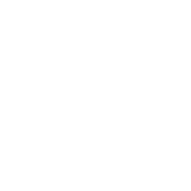
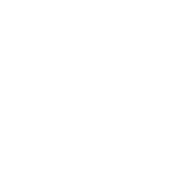

# Project Gen / Gen-1

NFTs with metadata that is 100% on-chain. No ipfs, cloud etc..

Generates animated random art on-chain using the SVG method. (supported from any NFT Markets)

Gen1 contract also supports **EIP-2981 NFT Royalty Standard** for first minters. (%7 of secondary market's sale price)

# About SVGs

[SVG](https://developer.mozilla.org/en-US/docs/Web/SVG/Tutorial/Introduction) is an XML language, similar to XHTML, which can be used to draw vector graphics, such as the ones shown to the right. It can be used to create an image either by specifying all the lines and shapes necessary, by modifying already existing raster images, or by a combination of both. The image and its components can also be transformed, composited together, or filtered to change their appearance completely.

# Example TokenURI Format
```
data:application/json;base64,eyJuYW1lIjogImFsbGl6ZSIsICJkZXNjcmlwdGlvbiI6ICJHZW4xIE4wOjUiLCAiYXR0cmlidXRlcyI6ICIiLCAiaW1hZ2UiOiAiZGF0YTppbWFnZS9zdmcreG1sO2Jhc2U2NCxQSE4yWnlCMlpYSnphVzl1UFNJeExqRWlJSGh0Ykc1elBTSm9kSFJ3T2k4dmQzZDNMbmN6TG05eVp5OHlNREF3TDNOMlp5SWdlRzFzYm5NNmVHeHBibXM5SW1oMGRIQTZMeTkzZDNjdWR6TXViM0puTHpFNU9Ua3ZlR3hwYm1zaUlIWnBaWGRDYjNnOUlqQWdNQ0F5TnpRZ01qYzBJaUJsYm1GaWJHVXRZbUZqYTJkeWIzVnVaRDBpYm1WM0lEQWdNQ0F5TnpRZ01qYzBJaUI0Yld3NmMzQmhZMlU5SW5CeVpYTmxjblpsSWlCemRIbHNaVDBpWW1GamEyZHliM1Z1WkMxamIyeHZjanBpYkdGamF5SStDanh6ZEhsc1pUNEtMbk4yWnpFZ2V3cHpkSEp2YTJVdFpHRnphR0Z5Y21GNU9pQXlNREE3Q25OMGNtOXJaUzFrWVhOb2IyWm1jMlYwT2lBNE1qSTdDbUZ1YVcxaGRHbHZiam9nWkdGemFDQXhOWE1nYVc1bWFXNXBkR1VnT3dwOUNrQnJaWGxtY21GdFpYTWdaR0Z6YUNCN0NtWnliMjBnZXdwemRISnZhMlV0WkdGemFHOW1abk5sZERvZ09ESXlPd3B6ZEhKdmEyVTZJQ013TUVaR1JrWTdDbjBLZEc4Z2V3cHpkSEp2YTJVdFpHRnphR0Z5Y21GNU9pQTBNVEU3Q25OMGNtOXJaVG9nSXpBd1JrWkdSanNLZlFwOUNqd3ZjM1I1YkdVK1BHUmxabk0rUEdacGJIUmxjaUJwWkQwaVpqRWlQanhtWlVOdmJuWnZiSFpsVFdGMGNtbDRJR3RsY201bGJFMWhkSEpwZUQwaU1TQXhJREFnTUNBd0lEQWdNQ0F4SUMweElpOCtQQzltYVd4MFpYSStQQzlrWldaelBqeHdZWFJvSUdOc1lYTnpQU0p6ZG1jeElpQm1hV3gwWlhJOUluVnliQ2dqWmpFcElpQnpkSGxzWlQwaVptbHNiRG9nYm05dVpUc2djM1J5YjJ0bE9pQjNhR2wwWlRzZ2MzUnliMnRsTFhkcFpIUm9PaUF3TGpNN0lITjBjbTlyWlMxc2FXNWxZMkZ3T2lCeWIzVnVaRHNnYzNSeWIydGxMV3hwYm1WcWIybHVPaUFnYldsMFpYSTdJSE4wY205clpTMXRhWFJsY214cGJXbDBPaUF4T3lJZ1pEMGlUVEV4TkNBME9DQTNOeUExT1ZwTk1UWXdJRFE0SURFNU55QTFPVnBOTVRZd0lESXlOaUF4T1RjZ01qRTFXazB4TVRRZ01qSTJJRGMzSURJeE5WcE5ORGdnTnpjZ05Ua2dPVGhhVFRJeU5pQTNOeUF5TVRVZ09UaGFUVEl5TmlBeE9UY2dNakUxSURFM05scE5ORGdnTVRrM0lEVTVJREUzTmxwTk56Y2dOVGtnT1RnZ056bGFUVEU1TnlBMU9TQXhOellnTnpsYVRURTVOeUF5TVRVZ01UYzJJREU1TlZwTk56Y2dNakUxSURrNElERTVOVnBOTlRrZ09UZ2dOemtnTUZwTk1qRTFJRGs0SURFNU5TQXdXazB5TVRVZ01UYzJJREU1TlNBeU56UmFUVFU1SURFM05pQTNPU0F5TnpSYVRUazRJRGM1SURBZ09USmFUVEUzTmlBM09TQXlOelFnT1RKYVRURTNOaUF4T1RVZ01qYzBJREU0TWxwTk9UZ2dNVGsxSURBZ01UZ3lXazAzT1NBd0lEa3lJRFk1V2sweE9UVWdNQ0F4T0RJZ05qbGFUVEU1TlNBeU56UWdNVGd5SURJd05WcE5OemtnTWpjMElEa3lJREl3TlZwTk1DQTVNaUEyT1NBeE16QmFUVEkzTkNBNU1pQXlNRFVnTVRNd1drMHlOelFnTVRneUlESXdOU0F4TkRSYVRUQWdNVGd5SURZNUlERTBORnBOT1RJZ05qa2dNVE13SURFek5scE5NVGd5SURZNUlERTBOQ0F4TXpaYVRURTRNaUF5TURVZ01UUTBJREV6T0ZwTk9USWdNakExSURFek1DQXhNemhhVFRZNUlERXpNQ0F4TXpZZ05ERmFUVEl3TlNBeE16QWdNVE00SURReFdrMHlNRFVnTVRRMElERXpPQ0F5TXpOYVRUWTVJREUwTkNBeE16WWdNak16V2sweE16QWdNVE0ySURReElETTVXazB4TkRRZ01UTTJJREl6TXlBek9WcE5NVFEwSURFek9DQXlNek1nTWpNMVdrMHhNekFnTVRNNElEUXhJREl6TlZwTk1UTTJJRFF4SURNNUlEazJXazB4TXpnZ05ERWdNak0xSURrMldrMHhNemdnTWpNeklESXpOU0F4TnpoYVRURXpOaUF5TXpNZ016a2dNVGM0V2swME1TQXpPU0E1TmlBeE1EUmFUVEl6TXlBek9TQXhOemdnTVRBMFdrMHlNek1nTWpNMUlERTNPQ0F4TnpCYVRUUXhJREl6TlNBNU5pQXhOekJhVFRNNUlEazJJREV3TkNBNU5GcE5Nak0xSURrMklERTNNQ0E1TkZwTk1qTTFJREUzT0NBeE56QWdNVGd3V2swek9TQXhOemdnTVRBMElERTRNRnBOT1RZZ01UQTBJRGswSURVNFdrMHhOemdnTVRBMElERTRNQ0ExT0ZwTk1UYzRJREUzTUNBeE9EQWdNakUyV2swNU5pQXhOekFnT1RRZ01qRTJXazB4TURRZ09UUWdOVGdnTWpOYVRURTNNQ0E1TkNBeU1UWWdNak5hVFRFM01DQXhPREFnTWpFMklESTFNVnBOTVRBMElERTRNQ0ExT0NBeU5URmFUVGswSURVNElESXpJRFF4V2sweE9EQWdOVGdnTWpVeElEUXhXazB4T0RBZ01qRTJJREkxTVNBeU16TmFUVGswSURJeE5pQXlNeUF5TXpOYVRUVTRJREl6SURReElERXlNRnBOTWpFMklESXpJREl6TXlBeE1qQmFUVEl4TmlBeU5URWdNak16SURFMU5GcE5OVGdnTWpVeElEUXhJREUxTkZwTk1qTWdOREVnTVRJd0lERXlXazB5TlRFZ05ERWdNVFUwSURFeVdrMHlOVEVnTWpNeklERTFOQ0F5TmpKYVRUSXpJREl6TXlBeE1qQWdNall5V2swME1TQXhNakFnTVRJZ05EbGFUVEl6TXlBeE1qQWdNall5SURRNVdrMHlNek1nTVRVMElESTJNaUF5TWpWYVRUUXhJREUxTkNBeE1pQXlNalZhVFRFeU1DQXhNaUEwT1NBeE0xcE5NVFUwSURFeUlESXlOU0F4TTFwTk1UVTBJREkyTWlBeU1qVWdNall4V2sweE1qQWdNall5SURRNUlESTJNVnBOTVRJZ05Ea2dNVE1nTnpaYVRUSTJNaUEwT1NBeU5qRWdOelphVFRJMk1pQXlNalVnTWpZeElERTVPRnBOTVRJZ01qSTFJREV6SURFNU9GcE5ORGtnTVRNZ056WWdNamhhVFRJeU5TQXhNeUF4T1RnZ01qaGFUVEl5TlNBeU5qRWdNVGs0SURJME5scE5ORGtnTWpZeElEYzJJREkwTmxwTk1UTWdOellnTWpnZ01UQTVXazB5TmpFZ056WWdNalEySURFd09WcE5Nall4SURFNU9DQXlORFlnTVRZMVdrMHhNeUF4T1RnZ01qZ2dNVFkxV2swM05pQXlPQ0F4TURrZ05ETmFUVEU1T0NBeU9DQXhOalVnTkROYVRURTVPQ0F5TkRZZ01UWTFJREl6TVZwTk56WWdNalEySURFd09TQXlNekZhVFRJNElERXdPU0EwTXlBNU1WcE5NalEySURFd09TQXlNekVnT1RGYVRUSTBOaUF4TmpVZ01qTXhJREU0TTFwTk1qZ2dNVFkxSURReklERTRNMXBOTVRBNUlEUXpJRGt4SURZMVdrMHhOalVnTkRNZ01UZ3pJRFkxV2sweE5qVWdNak14SURFNE15QXlNRGxhVFRFd09TQXlNekVnT1RFZ01qQTVXazAwTXlBNU1TQTJOU0F5V2sweU16RWdPVEVnTWpBNUlESmFUVEl6TVNBeE9ETWdNakE1SURJM01scE5ORE1nTVRneklEWTFJREkzTWxwTk9URWdOalVnTWlBeVdrMHhPRE1nTmpVZ01qY3lJREphVFRFNE15QXlNRGtnTWpjeUlESTNNbHBOT1RFZ01qQTVJRElnTWpjeVdrMDJOU0F5SURJZ09USmFUVEl3T1NBeUlESTNNaUE1TWxwTk1qQTVJREkzTWlBeU56SWdNVGd5V2swMk5TQXlOeklnTWlBeE9ESmFUVElnTWlBNU1pQXhNamhhVFRJM01pQXlJREU0TWlBeE1qaGFUVEkzTWlBeU56SWdNVGd5SURFME5scE5NaUF5TnpJZ09USWdNVFEyV2sweUlEa3lJREV5T0NBeE1EaGFUVEkzTWlBNU1pQXhORFlnTVRBNFdrMHlOeklnTVRneUlERTBOaUF4TmpaYVRUSWdNVGd5SURFeU9DQXhOalphVFRreUlERXlPQ0F4TURnZ05UQmFUVEU0TWlBeE1qZ2dNVFkySURVd1drMHhPRElnTVRRMklERTJOaUF5TWpSYVRUa3lJREUwTmlBeE1EZ2dNakkwV2sweE1qZ2dNVEE0SURVd0lEYzJXazB4TkRZZ01UQTRJREl5TkNBM05scE5NVFEySURFMk5pQXlNalFnTVRrNFdrMHhNamdnTVRZMklEVXdJREU1T0ZwTk1UQTRJRFV3SURjMklEYzFXazB4TmpZZ05UQWdNVGs0SURjMVdrMHhOallnTWpJMElERTVPQ0F4T1RsYVRURXdPQ0F5TWpRZ056WWdNVGs1V2swMU1DQTNOaUEzTlNBME5WcE5NakkwSURjMklERTVPU0EwTlZwTk1qSTBJREU1T0NBeE9Ua2dNakk1V2swMU1DQXhPVGdnTnpVZ01qSTVXazAzTmlBM05TQTBOU0E1V2sweE9UZ2dOelVnTWpJNUlEbGFUVEU1T0NBeE9Ua2dNakk1SURJMk5WcE5OellnTVRrNUlEUTFJREkyTlZwTk56VWdORFVnT1NBeU1WcE5NVGs1SURRMUlESTJOU0F5TVZwTk1UazVJREl5T1NBeU5qVWdNalV6V2swM05TQXlNamtnT1NBeU5UTmFUVFExSURrZ01qRWdNVEV4V2sweU1qa2dPU0F5TlRNZ01URXhXazB5TWprZ01qWTFJREkxTXlBeE5qTmFUVFExSURJMk5TQXlNU0F4TmpOYVRUa2dNakVnTVRFeElERXlORnBOTWpZMUlESXhJREUyTXlBeE1qUmFUVEkyTlNBeU5UTWdNVFl6SURFMU1GcE5PU0F5TlRNZ01URXhJREUxTUZwTk1qRWdNVEV4SURFeU5DQTVXazB5TlRNZ01URXhJREUxTUNBNVdrMHlOVE1nTVRZeklERTFNQ0F5TmpWYVRUSXhJREUyTXlBeE1qUWdNalkxV2sweE1URWdNVEkwSURrZ01USTFXazB4TmpNZ01USTBJREkyTlNBeE1qVmFUVEUyTXlBeE5UQWdNalkxSURFME9WcE5NVEV4SURFMU1DQTVJREUwT1ZvaUlDOCtQQzl6ZG1jKyJ9
```
 Base64 Decoded:
```
{"name": "allize", "description": "Gen1 N0:5", "attributes": "", "image": "data:image/svg+xml;base64,PHN2ZyB2ZXJzaW9uPSIxLjEiIHhtbG5zPSJodHRwOi8vd3d3LnczLm9yZy8yMDAwL3N2ZyIgeG1sbnM6eGxpbms9Imh0dHA6Ly93d3cudzMub3JnLzE5OTkveGxpbmsiIHZpZXdCb3g9IjAgMCAyNzQgMjc0IiBlbmFibGUtYmFja2dyb3VuZD0ibmV3IDAgMCAyNzQgMjc0IiB4bWw6c3BhY2U9InByZXNlcnZlIiBzdHlsZT0iYmFja2dyb3VuZC1jb2xvcjpibGFjayI+CjxzdHlsZT4KLnN2ZzEgewpzdHJva2UtZGFzaGFycmF5OiAyMDA7CnN0cm9rZS1kYXNob2Zmc2V0OiA4MjI7CmFuaW1hdGlvbjogZGFzaCAxNXMgaW5maW5pdGUgOwp9CkBrZXlmcmFtZXMgZGFzaCB7CmZyb20gewpzdHJva2UtZGFzaG9mZnNldDogODIyOwpzdHJva2U6ICMwMEZGRkY7Cn0KdG8gewpzdHJva2UtZGFzaGFycmF5OiA0MTE7CnN0cm9rZTogIzAwRkZGRjsKfQp9Cjwvc3R5bGU+PGRlZnM+PGZpbHRlciBpZD0iZjEiPjxmZUNvbnZvbHZlTWF0cml4IGtlcm5lbE1hdHJpeD0iMSAxIDAgMCAwIDAgMCAxIC0xIi8+PC9maWx0ZXI+PC9kZWZzPjxwYXRoIGNsYXNzPSJzdmcxIiBmaWx0ZXI9InVybCgjZjEpIiBzdHlsZT0iZmlsbDogbm9uZTsgc3Ryb2tlOiB3aGl0ZTsgc3Ryb2tlLXdpZHRoOiAwLjM7IHN0cm9rZS1saW5lY2FwOiByb3VuZDsgc3Ryb2tlLWxpbmVqb2luOiAgbWl0ZXI7IHN0cm9rZS1taXRlcmxpbWl0OiAxOyIgZD0iTTExNCA0OCA3NyA1OVpNMTYwIDQ4IDE5NyA1OVpNMTYwIDIyNiAxOTcgMjE1Wk0xMTQgMjI2IDc3IDIxNVpNNDggNzcgNTkgOThaTTIyNiA3NyAyMTUgOThaTTIyNiAxOTcgMjE1IDE3NlpNNDggMTk3IDU5IDE3NlpNNzcgNTkgOTggNzlaTTE5NyA1OSAxNzYgNzlaTTE5NyAyMTUgMTc2IDE5NVpNNzcgMjE1IDk4IDE5NVpNNTkgOTggNzkgMFpNMjE1IDk4IDE5NSAwWk0yMTUgMTc2IDE5NSAyNzRaTTU5IDE3NiA3OSAyNzRaTTk4IDc5IDAgOTJaTTE3NiA3OSAyNzQgOTJaTTE3NiAxOTUgMjc0IDE4MlpNOTggMTk1IDAgMTgyWk03OSAwIDkyIDY5Wk0xOTUgMCAxODIgNjlaTTE5NSAyNzQgMTgyIDIwNVpNNzkgMjc0IDkyIDIwNVpNMCA5MiA2OSAxMzBaTTI3NCA5MiAyMDUgMTMwWk0yNzQgMTgyIDIwNSAxNDRaTTAgMTgyIDY5IDE0NFpNOTIgNjkgMTMwIDEzNlpNMTgyIDY5IDE0NCAxMzZaTTE4MiAyMDUgMTQ0IDEzOFpNOTIgMjA1IDEzMCAxMzhaTTY5IDEzMCAxMzYgNDFaTTIwNSAxMzAgMTM4IDQxWk0yMDUgMTQ0IDEzOCAyMzNaTTY5IDE0NCAxMzYgMjMzWk0xMzAgMTM2IDQxIDM5Wk0xNDQgMTM2IDIzMyAzOVpNMTQ0IDEzOCAyMzMgMjM1Wk0xMzAgMTM4IDQxIDIzNVpNMTM2IDQxIDM5IDk2Wk0xMzggNDEgMjM1IDk2Wk0xMzggMjMzIDIzNSAxNzhaTTEzNiAyMzMgMzkgMTc4Wk00MSAzOSA5NiAxMDRaTTIzMyAzOSAxNzggMTA0Wk0yMzMgMjM1IDE3OCAxNzBaTTQxIDIzNSA5NiAxNzBaTTM5IDk2IDEwNCA5NFpNMjM1IDk2IDE3MCA5NFpNMjM1IDE3OCAxNzAgMTgwWk0zOSAxNzggMTA0IDE4MFpNOTYgMTA0IDk0IDU4Wk0xNzggMTA0IDE4MCA1OFpNMTc4IDE3MCAxODAgMjE2Wk05NiAxNzAgOTQgMjE2Wk0xMDQgOTQgNTggMjNaTTE3MCA5NCAyMTYgMjNaTTE3MCAxODAgMjE2IDI1MVpNMTA0IDE4MCA1OCAyNTFaTTk0IDU4IDIzIDQxWk0xODAgNTggMjUxIDQxWk0xODAgMjE2IDI1MSAyMzNaTTk0IDIxNiAyMyAyMzNaTTU4IDIzIDQxIDEyMFpNMjE2IDIzIDIzMyAxMjBaTTIxNiAyNTEgMjMzIDE1NFpNNTggMjUxIDQxIDE1NFpNMjMgNDEgMTIwIDEyWk0yNTEgNDEgMTU0IDEyWk0yNTEgMjMzIDE1NCAyNjJaTTIzIDIzMyAxMjAgMjYyWk00MSAxMjAgMTIgNDlaTTIzMyAxMjAgMjYyIDQ5Wk0yMzMgMTU0IDI2MiAyMjVaTTQxIDE1NCAxMiAyMjVaTTEyMCAxMiA0OSAxM1pNMTU0IDEyIDIyNSAxM1pNMTU0IDI2MiAyMjUgMjYxWk0xMjAgMjYyIDQ5IDI2MVpNMTIgNDkgMTMgNzZaTTI2MiA0OSAyNjEgNzZaTTI2MiAyMjUgMjYxIDE5OFpNMTIgMjI1IDEzIDE5OFpNNDkgMTMgNzYgMjhaTTIyNSAxMyAxOTggMjhaTTIyNSAyNjEgMTk4IDI0NlpNNDkgMjYxIDc2IDI0NlpNMTMgNzYgMjggMTA5Wk0yNjEgNzYgMjQ2IDEwOVpNMjYxIDE5OCAyNDYgMTY1Wk0xMyAxOTggMjggMTY1Wk03NiAyOCAxMDkgNDNaTTE5OCAyOCAxNjUgNDNaTTE5OCAyNDYgMTY1IDIzMVpNNzYgMjQ2IDEwOSAyMzFaTTI4IDEwOSA0MyA5MVpNMjQ2IDEwOSAyMzEgOTFaTTI0NiAxNjUgMjMxIDE4M1pNMjggMTY1IDQzIDE4M1pNMTA5IDQzIDkxIDY1Wk0xNjUgNDMgMTgzIDY1Wk0xNjUgMjMxIDE4MyAyMDlaTTEwOSAyMzEgOTEgMjA5Wk00MyA5MSA2NSAyWk0yMzEgOTEgMjA5IDJaTTIzMSAxODMgMjA5IDI3MlpNNDMgMTgzIDY1IDI3MlpNOTEgNjUgMiAyWk0xODMgNjUgMjcyIDJaTTE4MyAyMDkgMjcyIDI3MlpNOTEgMjA5IDIgMjcyWk02NSAyIDIgOTJaTTIwOSAyIDI3MiA5MlpNMjA5IDI3MiAyNzIgMTgyWk02NSAyNzIgMiAxODJaTTIgMiA5MiAxMjhaTTI3MiAyIDE4MiAxMjhaTTI3MiAyNzIgMTgyIDE0NlpNMiAyNzIgOTIgMTQ2Wk0yIDkyIDEyOCAxMDhaTTI3MiA5MiAxNDYgMTA4Wk0yNzIgMTgyIDE0NiAxNjZaTTIgMTgyIDEyOCAxNjZaTTkyIDEyOCAxMDggNTBaTTE4MiAxMjggMTY2IDUwWk0xODIgMTQ2IDE2NiAyMjRaTTkyIDE0NiAxMDggMjI0Wk0xMjggMTA4IDUwIDc2Wk0xNDYgMTA4IDIyNCA3NlpNMTQ2IDE2NiAyMjQgMTk4Wk0xMjggMTY2IDUwIDE5OFpNMTA4IDUwIDc2IDc1Wk0xNjYgNTAgMTk4IDc1Wk0xNjYgMjI0IDE5OCAxOTlaTTEwOCAyMjQgNzYgMTk5Wk01MCA3NiA3NSA0NVpNMjI0IDc2IDE5OSA0NVpNMjI0IDE5OCAxOTkgMjI5Wk01MCAxOTggNzUgMjI5Wk03NiA3NSA0NSA5Wk0xOTggNzUgMjI5IDlaTTE5OCAxOTkgMjI5IDI2NVpNNzYgMTk5IDQ1IDI2NVpNNzUgNDUgOSAyMVpNMTk5IDQ1IDI2NSAyMVpNMTk5IDIyOSAyNjUgMjUzWk03NSAyMjkgOSAyNTNaTTQ1IDkgMjEgMTExWk0yMjkgOSAyNTMgMTExWk0yMjkgMjY1IDI1MyAxNjNaTTQ1IDI2NSAyMSAxNjNaTTkgMjEgMTExIDEyNFpNMjY1IDIxIDE2MyAxMjRaTTI2NSAyNTMgMTYzIDE1MFpNOSAyNTMgMTExIDE1MFpNMjEgMTExIDEyNCA5Wk0yNTMgMTExIDE1MCA5Wk0yNTMgMTYzIDE1MCAyNjVaTTIxIDE2MyAxMjQgMjY1Wk0xMTEgMTI0IDkgMTI1Wk0xNjMgMTI0IDI2NSAxMjVaTTE2MyAxNTAgMjY1IDE0OVpNMTExIDE1MCA5IDE0OVoiIC8+PC9zdmc+"}
```
 Image Data :
```
data:image/svg+xml;base64,PHN2ZyB2ZXJzaW9uPSIxLjEiIHhtbG5zPSJodHRwOi8vd3d3LnczLm9yZy8yMDAwL3N2ZyIgeG1sbnM6eGxpbms9Imh0dHA6Ly93d3cudzMub3JnLzE5OTkveGxpbmsiIHZpZXdCb3g9IjAgMCAyNzQgMjc0IiBlbmFibGUtYmFja2dyb3VuZD0ibmV3IDAgMCAyNzQgMjc0IiB4bWw6c3BhY2U9InByZXNlcnZlIiBzdHlsZT0iYmFja2dyb3VuZC1jb2xvcjpibGFjayI+CjxzdHlsZT4KLnN2ZzEgewpzdHJva2UtZGFzaGFycmF5OiAyMDA7CnN0cm9rZS1kYXNob2Zmc2V0OiA4MjI7CmFuaW1hdGlvbjogZGFzaCAxNXMgaW5maW5pdGUgOwp9CkBrZXlmcmFtZXMgZGFzaCB7CmZyb20gewpzdHJva2UtZGFzaG9mZnNldDogODIyOwpzdHJva2U6ICMwMEZGRkY7Cn0KdG8gewpzdHJva2UtZGFzaGFycmF5OiA0MTE7CnN0cm9rZTogIzAwRkZGRjsKfQp9Cjwvc3R5bGU+PGRlZnM+PGZpbHRlciBpZD0iZjEiPjxmZUNvbnZvbHZlTWF0cml4IGtlcm5lbE1hdHJpeD0iMSAxIDAgMCAwIDAgMCAxIC0xIi8+PC9maWx0ZXI+PC9kZWZzPjxwYXRoIGNsYXNzPSJzdmcxIiBmaWx0ZXI9InVybCgjZjEpIiBzdHlsZT0iZmlsbDogbm9uZTsgc3Ryb2tlOiB3aGl0ZTsgc3Ryb2tlLXdpZHRoOiAwLjM7IHN0cm9rZS1saW5lY2FwOiByb3VuZDsgc3Ryb2tlLWxpbmVqb2luOiAgbWl0ZXI7IHN0cm9rZS1taXRlcmxpbWl0OiAxOyIgZD0iTTExNCA0OCA3NyA1OVpNMTYwIDQ4IDE5NyA1OVpNMTYwIDIyNiAxOTcgMjE1Wk0xMTQgMjI2IDc3IDIxNVpNNDggNzcgNTkgOThaTTIyNiA3NyAyMTUgOThaTTIyNiAxOTcgMjE1IDE3NlpNNDggMTk3IDU5IDE3NlpNNzcgNTkgOTggNzlaTTE5NyA1OSAxNzYgNzlaTTE5NyAyMTUgMTc2IDE5NVpNNzcgMjE1IDk4IDE5NVpNNTkgOTggNzkgMFpNMjE1IDk4IDE5NSAwWk0yMTUgMTc2IDE5NSAyNzRaTTU5IDE3NiA3OSAyNzRaTTk4IDc5IDAgOTJaTTE3NiA3OSAyNzQgOTJaTTE3NiAxOTUgMjc0IDE4MlpNOTggMTk1IDAgMTgyWk03OSAwIDkyIDY5Wk0xOTUgMCAxODIgNjlaTTE5NSAyNzQgMTgyIDIwNVpNNzkgMjc0IDkyIDIwNVpNMCA5MiA2OSAxMzBaTTI3NCA5MiAyMDUgMTMwWk0yNzQgMTgyIDIwNSAxNDRaTTAgMTgyIDY5IDE0NFpNOTIgNjkgMTMwIDEzNlpNMTgyIDY5IDE0NCAxMzZaTTE4MiAyMDUgMTQ0IDEzOFpNOTIgMjA1IDEzMCAxMzhaTTY5IDEzMCAxMzYgNDFaTTIwNSAxMzAgMTM4IDQxWk0yMDUgMTQ0IDEzOCAyMzNaTTY5IDE0NCAxMzYgMjMzWk0xMzAgMTM2IDQxIDM5Wk0xNDQgMTM2IDIzMyAzOVpNMTQ0IDEzOCAyMzMgMjM1Wk0xMzAgMTM4IDQxIDIzNVpNMTM2IDQxIDM5IDk2Wk0xMzggNDEgMjM1IDk2Wk0xMzggMjMzIDIzNSAxNzhaTTEzNiAyMzMgMzkgMTc4Wk00MSAzOSA5NiAxMDRaTTIzMyAzOSAxNzggMTA0Wk0yMzMgMjM1IDE3OCAxNzBaTTQxIDIzNSA5NiAxNzBaTTM5IDk2IDEwNCA5NFpNMjM1IDk2IDE3MCA5NFpNMjM1IDE3OCAxNzAgMTgwWk0zOSAxNzggMTA0IDE4MFpNOTYgMTA0IDk0IDU4Wk0xNzggMTA0IDE4MCA1OFpNMTc4IDE3MCAxODAgMjE2Wk05NiAxNzAgOTQgMjE2Wk0xMDQgOTQgNTggMjNaTTE3MCA5NCAyMTYgMjNaTTE3MCAxODAgMjE2IDI1MVpNMTA0IDE4MCA1OCAyNTFaTTk0IDU4IDIzIDQxWk0xODAgNTggMjUxIDQxWk0xODAgMjE2IDI1MSAyMzNaTTk0IDIxNiAyMyAyMzNaTTU4IDIzIDQxIDEyMFpNMjE2IDIzIDIzMyAxMjBaTTIxNiAyNTEgMjMzIDE1NFpNNTggMjUxIDQxIDE1NFpNMjMgNDEgMTIwIDEyWk0yNTEgNDEgMTU0IDEyWk0yNTEgMjMzIDE1NCAyNjJaTTIzIDIzMyAxMjAgMjYyWk00MSAxMjAgMTIgNDlaTTIzMyAxMjAgMjYyIDQ5Wk0yMzMgMTU0IDI2MiAyMjVaTTQxIDE1NCAxMiAyMjVaTTEyMCAxMiA0OSAxM1pNMTU0IDEyIDIyNSAxM1pNMTU0IDI2MiAyMjUgMjYxWk0xMjAgMjYyIDQ5IDI2MVpNMTIgNDkgMTMgNzZaTTI2MiA0OSAyNjEgNzZaTTI2MiAyMjUgMjYxIDE5OFpNMTIgMjI1IDEzIDE5OFpNNDkgMTMgNzYgMjhaTTIyNSAxMyAxOTggMjhaTTIyNSAyNjEgMTk4IDI0NlpNNDkgMjYxIDc2IDI0NlpNMTMgNzYgMjggMTA5Wk0yNjEgNzYgMjQ2IDEwOVpNMjYxIDE5OCAyNDYgMTY1Wk0xMyAxOTggMjggMTY1Wk03NiAyOCAxMDkgNDNaTTE5OCAyOCAxNjUgNDNaTTE5OCAyNDYgMTY1IDIzMVpNNzYgMjQ2IDEwOSAyMzFaTTI4IDEwOSA0MyA5MVpNMjQ2IDEwOSAyMzEgOTFaTTI0NiAxNjUgMjMxIDE4M1pNMjggMTY1IDQzIDE4M1pNMTA5IDQzIDkxIDY1Wk0xNjUgNDMgMTgzIDY1Wk0xNjUgMjMxIDE4MyAyMDlaTTEwOSAyMzEgOTEgMjA5Wk00MyA5MSA2NSAyWk0yMzEgOTEgMjA5IDJaTTIzMSAxODMgMjA5IDI3MlpNNDMgMTgzIDY1IDI3MlpNOTEgNjUgMiAyWk0xODMgNjUgMjcyIDJaTTE4MyAyMDkgMjcyIDI3MlpNOTEgMjA5IDIgMjcyWk02NSAyIDIgOTJaTTIwOSAyIDI3MiA5MlpNMjA5IDI3MiAyNzIgMTgyWk02NSAyNzIgMiAxODJaTTIgMiA5MiAxMjhaTTI3MiAyIDE4MiAxMjhaTTI3MiAyNzIgMTgyIDE0NlpNMiAyNzIgOTIgMTQ2Wk0yIDkyIDEyOCAxMDhaTTI3MiA5MiAxNDYgMTA4Wk0yNzIgMTgyIDE0NiAxNjZaTTIgMTgyIDEyOCAxNjZaTTkyIDEyOCAxMDggNTBaTTE4MiAxMjggMTY2IDUwWk0xODIgMTQ2IDE2NiAyMjRaTTkyIDE0NiAxMDggMjI0Wk0xMjggMTA4IDUwIDc2Wk0xNDYgMTA4IDIyNCA3NlpNMTQ2IDE2NiAyMjQgMTk4Wk0xMjggMTY2IDUwIDE5OFpNMTA4IDUwIDc2IDc1Wk0xNjYgNTAgMTk4IDc1Wk0xNjYgMjI0IDE5OCAxOTlaTTEwOCAyMjQgNzYgMTk5Wk01MCA3NiA3NSA0NVpNMjI0IDc2IDE5OSA0NVpNMjI0IDE5OCAxOTkgMjI5Wk01MCAxOTggNzUgMjI5Wk03NiA3NSA0NSA5Wk0xOTggNzUgMjI5IDlaTTE5OCAxOTkgMjI5IDI2NVpNNzYgMTk5IDQ1IDI2NVpNNzUgNDUgOSAyMVpNMTk5IDQ1IDI2NSAyMVpNMTk5IDIyOSAyNjUgMjUzWk03NSAyMjkgOSAyNTNaTTQ1IDkgMjEgMTExWk0yMjkgOSAyNTMgMTExWk0yMjkgMjY1IDI1MyAxNjNaTTQ1IDI2NSAyMSAxNjNaTTkgMjEgMTExIDEyNFpNMjY1IDIxIDE2MyAxMjRaTTI2NSAyNTMgMTYzIDE1MFpNOSAyNTMgMTExIDE1MFpNMjEgMTExIDEyNCA5Wk0yNTMgMTExIDE1MCA5Wk0yNTMgMTYzIDE1MCAyNjVaTTIxIDE2MyAxMjQgMjY1Wk0xMTEgMTI0IDkgMTI1Wk0xNjMgMTI0IDI2NSAxMjVaTTE2MyAxNTAgMjY1IDE0OVpNMTExIDE1MCA5IDE0OVoiIC8+PC9zdmc+
```
Let's copy and paste image data to your browser address bar!

# Example GEN's






 
 
  
